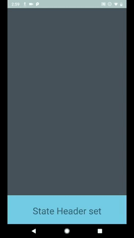
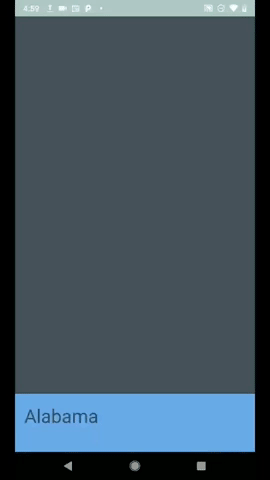

This project shows a RecyclerView that acts as a bottom drawer.

Second step: Show a header object above the list of states and cities
- Put a header on top of the list for both city and state views (different header for each)
- Make the adapter recognize what kind of object in the list needs to be created, and populate a view specific to that object
- The Recycler should empty when you click on a state, and repopulate via a new adapter with a list of cities for the state you clicked on

First step: Show a list of states and cities
- Create a RecyclerView which can be dragged up on the main activity
- Populate the View with a list of States from a json file
- Implement a click listener to show which state was clicked

